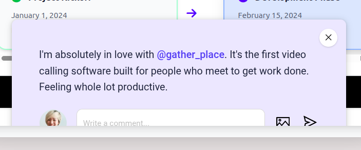

# MII Portal To-do list
## Rules

Formatting
Use variables for colors
Handle:
- loading state
- check errors received and propagate in UI

## Pending Tasks

- Schedule meeting page: after selecting meeting members clicking outside should disable it
underline username (startup dashboard)
- Remake all popups with antd
- Recover static dashboard and merge with dynamic (fixed css)
- Header
  - Whole Div relative or sticky
  - Mobile Menu Icon centered horizontally 
- 
- Finance: Send Remainder is incorrect 
  - the button should open a popup that shows the current pending requests and an option to send remainder to the manager for each one
  - Pending requests in the schedule Table should also have the send remainder button
  - ˅ button should open full list or full list popup (remove the view all and downloads, there is already an export details above)
  - Change text to be more user friendly (discuss)

#### Anurag 
Login Flow
Merge everyone's code 
Dashboard page
    - Button like others in view buttons
    - Numbers should all be on the same height
    - Next Meeting, Agenda in card center and space 

For each page 
- Check Database
- check API routes and add them to pages

# Frontend 

#### Leeni 

Remove Welcome user just redirect to startup info form (/info)
Info Form end logout button

Buttons
Header: On photo directly open page, menu not closing in mobile
popup

#### Srashti

#### Saloni
finance
view more button, view more things, remove dialog box

#### Karishma

#### Kavita
- [ ] HR Directory

# Backend

#### Rajat

- [ ] Refresh and Access token remove email, add auth id
- [ ] Reset Password flow 
- [ ] Create account route everyone's ids are unique (for no conflict in meeting searching)

#### Sourabh Mourya

- [ ] Startup dashboard API integration
env var API urls
Redirect to dashboard if already logged in
- [ ] Add roles in account creation service ( auth id in user tables )

# Design

#### Saurav

