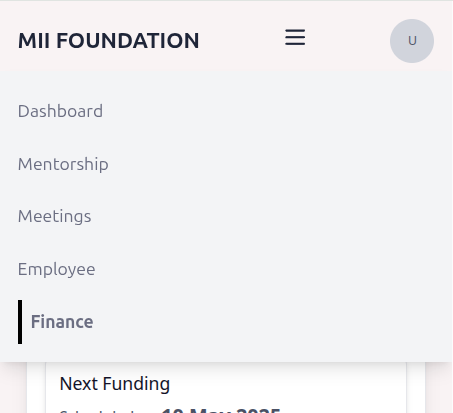

# MII Portal To-do list

underline usename (startup dashboard)
- Startup Stats: Total revenue in one line

#### 

----
## Meeting

Title
Start Time
End Time
Date 
Status
Attendees (6 cols)
Summary (When Meeting is over)
Docs
Meeting
Location
Link

/getAllMeeting (Get all meetings where attendees id contains current user id)
/createMeeting
/modifyMeeting
/deleteMeeting

## Meeting  Table

Startup
- Mentor
- HR 
- Manager

Mentor 
- All associated startups 
- HR 
- Manager

HR
- All Startups 
- All mentors 
- HR 
- Manager

Manager, Admin 
- All Startups 
- All mentors 
- HR 
- Manager
- Investor

----

## Rules

Formatting
Use valiables for colors
Handle 
- loading state
- check errors received and propagate in UI

## Pending Tasks

#### Anurag 
Login Flow
Merge everyone's code 
Dashboard page
    - Button like others in view buttons
    - Numbers should all be on the same height
    - Next Meeting, Agenda in card center and space 

For each page 
- Check Database
- check API routes and add them to pages

# Frontend 

#### Leeni 

Remove Welcome user just redirect to startup info form (/info)
Info Form end logout button

Buttons
Header: On photo directly open page, menu not closing in mobile
popup

#### Srashti
- [ ] Meetings page (elements like employee dir)
Schedule new meeting page
    - Line in the whole page (below title) 
    - Center
    - Button Color SOlid
    - Attendees checkbox

#### Saloni
finance
view more button, view more things, remove dialog box

#### Karishma

#### Kavita
- [ ] HR Directory

# Backend

#### Rajat

- [ ] Refreh and Access token remove email, add auth id
- [ ] Reset Password flow 
- [ ] Create account route everyone's ids are unique (for no conflict in meeting searching)

#### Sourabh Mourya

- [ ] Startup dashboard API integration
env var API urls
Redirect to dashboard if already logged in
- [ ] Add roles in account creation service ( auth id in user tables )

# Design

#### Saurav

# Completed

## Anruag
- [x] New Login static page

## Leeni

- [ ] Add Favicon
Mobile view

Proper Header
- Add links

## Roles

Startup
Mentor 
HR
Manager
Admin 
Investor

